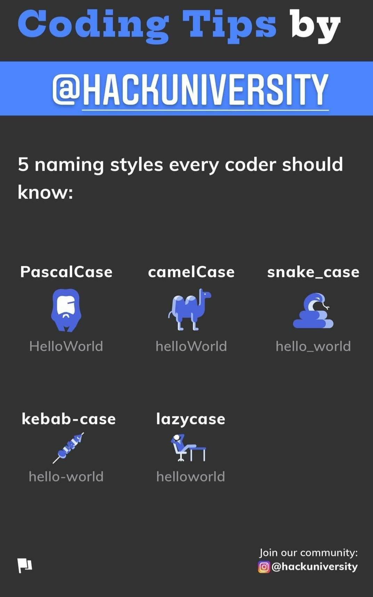
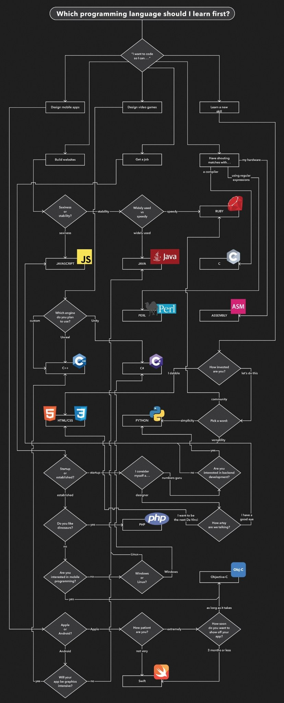

[Retorna](README.md)

# Dicas

    
Como criar um repositório ou um gist rapidamente?

- Existem 2 URLs que fornecem um acesso rápido a criação de repositórios ou *gists*.
    + Para criar um novo repositório basta acessar [repo.new](http://repo.new)
    + Para criar um novo *gist* basta acessar [gist.new](http://gist.new)

**Fonte: visto no grupo CodeWalkers (Telegram)**

	
Como visualizar um repositório em modo somente-leitura?

**Para fazer isso, é preciso ter o endereço completo do repositório no GitHub.**

Basta apenas adicionar, após o *github*, o termo *1s*.

Exemplo:

Endereço do repositório: https://github.com/rt-oliveira/ConteudosTI
 

Endereço alterado: https://github1s.com/rt-oliveira/ConteudosTI
  

**Fonte: visto no grupo CodeWalkers**

    
Estilos de nome que todo programador deveria saber...

**Fonte: facebook.com/TheHackUniversity** 
**Visto no grupo CodeWalkers (Telegram)**

	
Faça projetos

**Fonte https://instagram.com/berg.dev ** 
**Visto no grupo CodeWalkers (Telegram)**

	
Infográfico: What Code Should You Learn?

[Link original](https://i.pinimg.com/originals/fb/90/8f/fb908f9e0a932d4a123b62aa28f02ed9.jpg)

**Fonte: visto no grupo CodeWalkers (Telegram)**

	
Qual linguagem deveria estudar primeiro?

[Link original](https://pbs.twimg.com/media/ExPbjUPW8Ak3X4U?format=jpg&name=large)

**Fonte: visto no grupo CodeWalkers (Telegram)**

